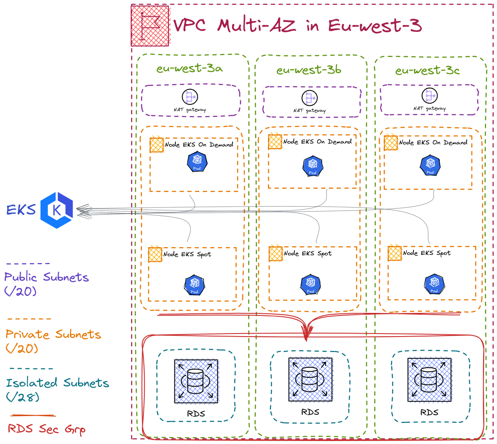
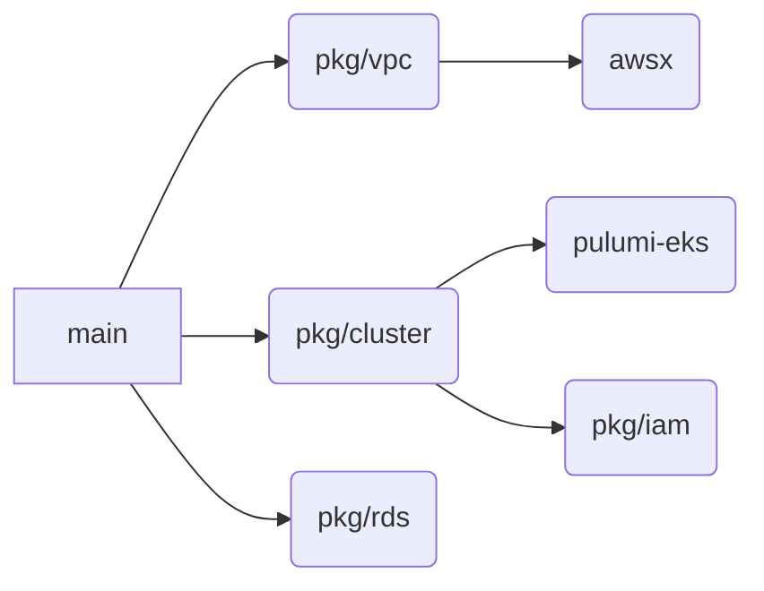

# Pulumi EKS + RDS

# Architecture



## VPC Design Multi-Az

We have designed our VPC with three types of subnets:

-   **Public subnets**: These subnets are designed to be publicly accessible from the internet. We will be using a NAT gateway in the public subnets to allow pods to communicate with external endpoints.
    
-   **Private subnets**: These subnets are not accessible from the internet and will be used for our EKS nodes.
    
-   **Isolated subnets**: These subnets are also not accessible from the internet and will be used for our RDS cluster. By using an isolated subnet, we can provide the most secure environment for our database.
    

## Nodegroup

For our EKS cluster, we have chosen to use a managed node group. Managed node groups come with all the prerequisite software and permissions, connect themselves to the cluster, and provide an easier experience for lifecycle actions like autoscaling and updates. In most cases, managed node groups will reduce the operational overhead of self-managing nodes and provide a much easier experience.

## RDS Cluster

For our database, we have chosen to use an RDS cluster instead of a classic RDS instance. This allows us to:

-   Scale read operations by creating read replicas
-   Provide automatic failover in case of a database instance failure
-   Use sharding in the future to scale write operations horizontally across multiple database instances

We will be using an isolated subnet for our RDS cluster to ensure the highest level of security.


# Configuration

```
config:
  aws:region: eu-west-3
  network:
    name: "vpc-for-eks"
    cidrBlock: "172.16.0.0/16"
    subnets:
      privateSubnets:
        cidrMask: 20
      publicSubnets:
        cidrMask: 20
      isolatedSubnets:
        cidrMask: 28
  cluster:
    name: "cluster-eks"
    nodeGrps:
      - name: "on-demand"
        capacityType: "ON_DEMAND"
        instanceTypes:
          - "t3.medium"
        scaling:
          maxSize: 3
          desiredSize: 3
          minSize: 3
      - name: "spot"
        capacityType: SPOT
        instanceTypes:
          - "t2.micro"
        scaling:
          maxSize: 3
          minSize: 3
          desiredSize: 3
        taints:
          - key: "spot"
            effect: "NO_SCHEDULE"
            value: "true"
  database:
    name: "rds-instance"
    instanceType: "db.r5d.large"
    port: 5432
    enable: true
    storageSize: 100
    storageType: "io1"
    iops: 1000
    dbName: "db_starton"
    engine: "postgres"
    engineVersion: "13.7"

```
The config section of the pulumi.dev.yaml file contains the configuration settings for deploying the infrastructure.

In the network section, the name and cidrBlock parameters are used to define the VPC name and its IP range. The subnets parameter is used to define the subnets with their respective cidrMask. The configuration defines three subnets: privateSubnets with a cidrMask of 20, publicSubnets with a cidrMask of 20, and isolatedSubnets with a cidrMask of 28.

In the cluster section, the name parameter defines the name of the EKS cluster. The nodeGrps parameter is used to define the different node groups that will be part of the cluster. The configuration provides two node groups: nodegrp-on-demand and nodegrp-spot. In each nodegroup scaling configuration is defined in order to select the type or number of the instance. Additionally, the taints parameter is used to add a taint with specific key/value. The Valid values for effect of the taint: `NO_SCHEDULE`, `NO_EXECUTE`, `PREFER_NO_SCHEDULE`

In the database section, the configuration deploys an RDS instance named rds-instance with an instanceType of db.r5d.large. The port parameter defines the port number that will be used to connect to the database. The enable parameter is set to false, which means the RDS instance can be disable. The storageSize parameter defines the storage size in GB for the database. The storageType parameter is set to io1 for I/O performance optimization, and the iops parameter is set to 1000. The dbName parameter defines the name of the database, and the engine and engineVersion parameters are set to postgres and 13.7, respectively. The RDS instance is deployed in multi-AZ mode, which allows for read replicas and read/write endpoints to be created.

## Pulumi Dependencies



# How to deploy

## Requirements

 - Go v1.18
 - Aws cli

## Download go dependencies

```
go mod tidy
```

## Run

```
export AWS_ACCESS_KEY_ID=<AWS-KEY-ID>
export AWS_SECRET_ACCESS_KEY=<AWS-SECRET-ACCESS-KEY>
pulumi up
```

## Get secret of resources

```
pulumi stack --show-secrets
```


## Test the connection

```
aws eks --region eu-west-3 update-kubeconfig --name <CLUSTER-ID>

kubectl run pgsql-postgresql-client --rm --tty -i --restart='Never' --namespace default --image docker.io/bitnami/postgresql:13.7.0 --env="PGPASSWORD=<GENERATE-PASSWORD-SECRET>"  --command -- psql --host <primary-rds-endpoint> -U adminstarton -d db_starton
```

## Todo list

 - [ ] - Use S3 as a storage backend for Pulumi state.
 - [ ] - Use secret encryption with AWS Key Management Service (KMS).
 - [ ] - Add some unit tests.
 - [ ] - Add Go lint test.
 - [ ] - Define a Makefile to automate some tasks, such as running tests and linting.
 - [ ] - Convert to a Pulumi provider so that it can be reused in other languages:
    - [ ] - Use Pulumi's code generation to generate SDKs for different languages.
    - [ ] - Add a code generation operation to the Makefile.